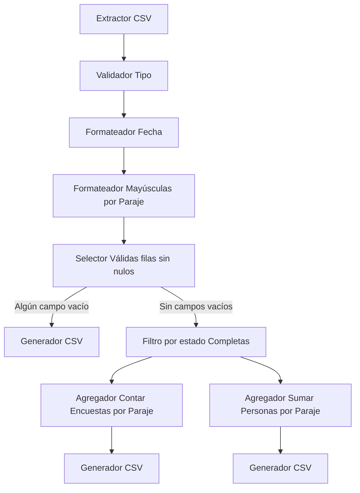

# TP Integrador - Pipeline

## Asignatura: Algoritmos y Estructuras de Datos 2

## Período: 1C 2023

## Integrantes:

- [Ariel Bernardo Vergara](https://github.com/avergara-intercept)
- [Hernan Andres Rodriguez](https://github.com/HernanARodriguez)
- [Juan Andres Cherviere](https://github.com/juano83dev)
- [Jeremy Andes](https://github.com/jeremyandes)

# Introducción

El objetivo de este trabajo integrador es crear un prototipo de un pipeline en lenguaje Python, con el fin de
procesar un conjunto de datos de entrada desde un CSV, y obtener múltiples resultados de salida también en CSV.
El pipeline debe ser capaz de ejecutar secuencialmente varios procesos configurados.

# Ejemplo de uso

En la consola bash (Git Bash / zsh), ya sea por medio de un IDE o de la terminal, ejecutar el siguiente comando:

```
python3 src/Main.py
```

Luego, nos indicará que elijamos un archivo inicial para ejecutar el pipeline, por lo cual ingresamos la
opción numérica, y luego presiontamos la tecla Enter.

# El pipeline es capaz de

- Leer un archivo CSV
- Filtrar datos
- Modificar datos
- Detener su ejecución en caso de errores
- Guardar los resultados en un archivo CSV
- Imprimir en consola los resultados en tiempo real de cada componente

# Estructura del Pipeline


